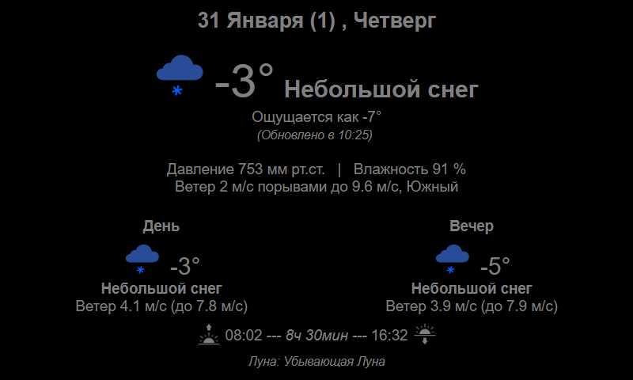

# Weather display
Show weather forecast for displaying on Raspberry Pi 3 display.


## Rendered page should looks like:
_(It is in Russian)_



## Python virtualenv on Windows
```bash
python3 -m pip install -U pip
python3 -m pip install -U setuptools
python3 -m pip install -U virtualenv

virtualenv -p python3 --clear .venv --clear
source .venv/Scripts/activate

python3 -m pip install -U -r requirements.txt
```


## More info:
https://tech.yandex.ru/weather/doc/dg/concepts/forecast-response-test-docpage

### Ignore API KEY file changes
```bash
git update-index --assume-unchanged api_key.yml
```
